<h1 align="center">🌟 Práctica 2 - Visión por Computador (Curso 2024/2025)</h1>

</a>
Se han completado todas las tareas solicitadas de la **Práctica 2** para la asignatura **Visión por Computador**. Funciones básicas de OpenCV.

*Trabajo realizado por*:

[](https://github.com/kratoscordoba7)

[](https://github.com/AlejandroDavidArzolaSaavedra)

## 🛠️ Librerías Utilizadas

[](Link_To_Your_NumPy_Page)
[](Link_To_Your_OpenCV_Page)
[](Link_To_Your_Matplotlib_Page)
[](Link_To_Your_Mediapipe_Page)
[](Link_To_Your_Pygame_Page)


---
## 🚀 Cómo empezar

Para comenzar con el proyecto, sigue estos pasos:

> [!NOTE]  
> Debes de situarte en un environment configurado como se definió en el cuaderno de la práctica de [otsedom](https://github.com/otsedom/otsedom.github.io/blob/main/VC/P1/README.md#111-comandos-basicos-de-anaconda) y adicionalmente instalarte pygame y mediapipe, en el propio cuaderno pone como realizarlo.

### Paso 1: Abrir VSCode y situarse en el directorio:
   
   `C:\Users\TuNombreDeUsuario\anaconda3\envs\VCP2`
   
### Paso 2: Clonar y trabajar en el proyecto localmente (VS Code)
1. **Clona el repositorio**: Ejecuta el siguiente comando en tu terminal para clonar el repositorio:
   ```bash
   git clone https://github.com/kratoscordoba7/VCP2.git
   ```
2. Una vez clonado, todos los archivos han de estar situado en el environment del paso 1

### Paso 3: Abrir Anaconda prompt y activar el envioroment:
   ```bash
   conda activate NombreDeTuEnvironment
   ```
Tras estos pasos debería poder ejecutar el proyecto localmente

---

<h2 align="center">📋 Tareas</h2>

# Tarea 1 Máximo filas y columnas de píxeles blancos 

TAREA: Realizar la cuenta de píxeles blancos por filas (en lugar de por columnas). Determinar el máximo para filas y columnas (uno para cada) y muestra el número de filas con un número de píxeles blancos mayor o igual que 0.95*máximo.

## Función Principal: CannyToRowPlot(canny, text)
```python
def CannyToRowPlot(canny):
    # Cuenta el número de píxeles blancos (255) por fila, el 1 indica que es por filas. Primero los computa y después lo simplifica en un solo entero
    row_counts = cv2.reduce(canny, 1, cv2.REDUCE_SUM, dtype=cv2.CV_32SC1)
    """"
    Notas ==> : implica que toma TODOS los valores (Al fin y al cabo es un array de arrays, toma el primer valor, y único, de cada array)
                Se obtiene un array de longitud igual al alto, porque se evalúa por columnas. 
                Cada valor representa el número de píxeles blancos por columnas.
            
    """
    rows = row_counts[:, 0] / (255 * canny.shape[1])

    # Determina el valor máximo de píxeles blancos por fila.
    maxfil = np.max(rows)

    # Encuentra las filas con un número de píxeles blancos mayor o igual que 0.95 * maxfil
    threshold = 0.95 * maxfil
    filas_con_maximos = np.where(rows >= threshold)[0] # Se toma el cero porque la función np.where() devuelve un objeto array con listas dentro.

    # Muestra el resultado gráficamente
    plt.figure()
    plt.subplot(1, 2, 1)
    plt.axis("off")
    plt.title("Canny")
    plt.imshow(canny, cmap='gray')

    plt.subplot(1, 2, 2)
    plt.title("Respuesta de Canny por filas")
    plt.xlabel("Filas")
    plt.ylabel("% píxeles")
    plt.plot(rows)

    plt.xlim([0, canny.shape[0]])

    # Imprime los resultados
    print(f"Valor máximo de píxeles blancos por fila: {maxfil}")
    print(f"Número de filas con más del 95% del valor máximo: {len(filas_con_maximos)}")
    print(f"Posiciones de las filas con más del 95% del valor máximo: {filas_con_maximos}")
```

Esta función recibe dos parámetros:

   - canny: Una imagen binaria (generalmente una imagen resultante de la aplicación del algoritmo de Canny) que contiene píxeles blancos (255) que representan los bordes detectados.
   - text: Un string que define el título de la imagen y el gráfico, permitiendo una descripción personalizada para cada ejecución.

## Reducción de la imagen a valores por fila:
   - Se calcula la suma de los valores de píxeles por cada fila de la imagen usando la función cv2.reduce. El resultado es un vector de valores que representa la cantidad total de píxeles blancos por fila.
     
## Normalización del valor de cada fila:
   - El conteo de píxeles blancos se normaliza dividiendo entre el producto de 255 (valor de píxel blanco) y el número de columnas de la imagen, obteniendo así el porcentaje de píxeles blancos por cada fila de la imagen.
     
## Detección de filas con máximo porcentaje de bordes:
   - Se calcula el valor máximo de píxeles blancos en una fila (maxfil) y se establece un umbral del 95% de ese valor máximo.
   - Se identifica las filas que tienen una proporción de píxeles blancos mayor o igual al 95% del valor máximo.
    
## Visualización:
   - La función genera una gráfica utilizando matplotlib que muestra:
   - La imagen original procesada por Canny (en una escala de grises).
   - Un gráfico que muestra la distribución de píxeles blancos por cada fila.

<div align="center">
   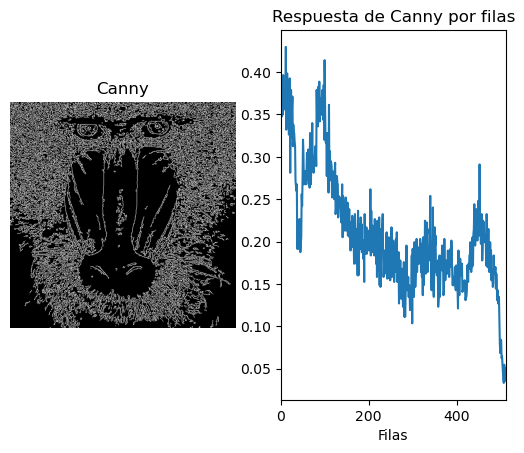
</div>

## Salida:
La función imprime en consola los siguientes valores:
   - El valor máximo de píxeles blancos por fila (maxfil).
   - El número de filas que contienen al menos el 95% del valor máximo de píxeles blancos.
   - Las posiciones de estas filas en la imagen.

```
Ejemplo salida para la imagen del mandril:
   - Valor máximo de píxeles blancos por fila: 0.4296875
   - Número de filas con más del 95% del valor máximo: 2
   - Posiciones de las filas con más del 95% del valor máximo: [ 12 100]
```

# Tarea 2 Umbralizado a la imagen de Sobel

**Valor máximo de píxeles blancos por columna:** 0.59765625

**TAREA:** Se aplicó un umbralizado a la imagen resultante del filtro Sobel (convertida a 8 bits) y se realizó un conteo de píxeles no nulos por filas y columnas, similar al realizado con la salida de Canny. A continuación, se calcularon los valores máximos de conteo por filas y columnas, y se determinaron las filas y columnas que superan el 95% del valor máximo. Estas filas y columnas fueron resaltadas en la imagen utilizando primitivas gráficas.

- **Valor del Umbral:** 170
- **Número de columnas con más del 95% del valor máximo:** 4  
- **Posiciones de las columnas con más del 95% del valor máximo:** [261, 262, 263, 264]

- **Valor máximo de píxeles blancos por fila:** 0.55078125  
- **Número de filas con más del 95% del valor máximo:** 2  
- **Posiciones de las filas con más del 95% del valor máximo:** [508, 509]
<br>
<br>

<div align="center">
   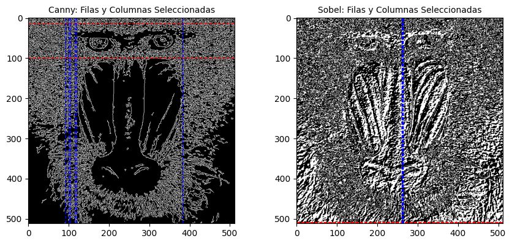
</div>

<br>
<br>

Al comparar los resultados obtenidos de las imágenes procesadas por Sobel y Canny, se observa que el método Canny produce un mayor número de filas y columnas con píxeles no nulos en comparación con Sobel. Además, los histogramas de Sobel muestran una distribución más homogénea en las filas y columnas, mientras que en Canny se evidencia una mayor disparidad en la distribución de los valores. Esta diferencia sugiere que Canny es más eficaz para resaltar características en la imagen, proporcionando un mayor contraste en la detección de bordes en comparación con Sobel.

<div align="center">
   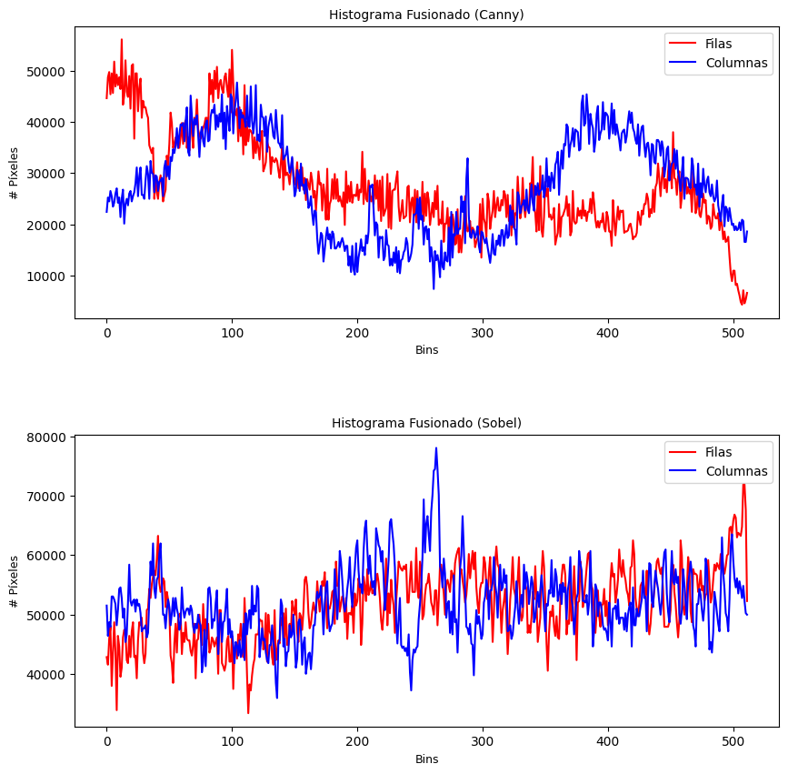
</div>

<br>
<br>

Para el código, reutilizamos parte de lo desarrollado en la tarea 2 y modificamos segmentos del código proporcionado por el profesor para optimizar su uso mediante funciones. Esto nos permitió evitar la duplicación de código, especialmente en la sección de cálculo de columnas. Un fragmento de código interesante que muestra cómo umbralizamos la imagen utilizando el filtro Sobel es el siguiente:

```python
# Aplicar un filtro Gaussiano para suavizar la imagen original y eliminar altas frecuencias
ggris = cv2.GaussianBlur(gris, (3, 3), 0)

# Calcular el gradiente en ambas direcciones (horizontal y vertical)
sobelx = cv2.Sobel(ggris, cv2.CV_64F, 1, 0)  # Gradiente en x
sobely = cv2.Sobel(ggris, cv2.CV_64F, 0, 1)  # Gradiente en y

# Combinar ambos resultados
sobel = cv2.add(sobelx, sobely)

# Definir el valor del umbral
valorUmbral = 170

# Convertir la imagen a 8 bits
sobel8 = np.uint8(sobel)

# Obtener la imagen umbralizada según el valor definido
res, imagenUmbralizada = cv2.threshold(sobel8, valorUmbral, 255, cv2.THRESH_BINARY)
```

# Tarea 3 Demostrador que captura las imágenes de la cámara

TAREA: Proponer un demostrador que capture las imágenes de la cámara, y les permita exhibir lo aprendido en estas dos prácticas ante quienes no cursen la asignatura :). Es por ello que además de poder mostrar la imagen original de la webcam, incluya al menos dos usos diferentes de aplicar las funciones de OpenCV trabajadas hasta ahora.

## Funcionalidades
El script ofrece cuatro modos de procesamiento de imágenes, cada uno activado mediante diferentes teclas del teclado:

   - Modo Original (Tecla '0'): Muestra la imagen de la cámara sin modificaciones.
```python
def normal(frame):
    cv2.imshow('Imagen original', frame)
```
   - Modo Canny (Tecla '1'): Aplica el filtro de detección de bordes de Canny.
```python
def NormalToCanny(frame):
    canny = cv2.Canny(frame, 100, 400)
    cv2.imshow('Imagen Canny', canny)
```
<div align="center">
   
</div>
   - Modo de Segmentación de Color Azul (Tecla '2'): Detecta y mantiene el color azul en la imagen, mientras el resto se muestra en escala de grises.
<div align="center">
   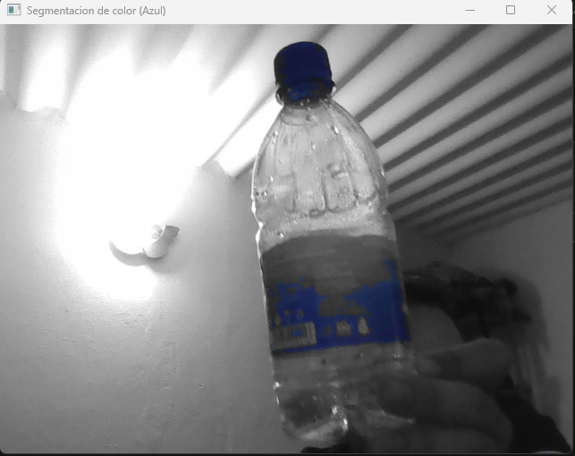
   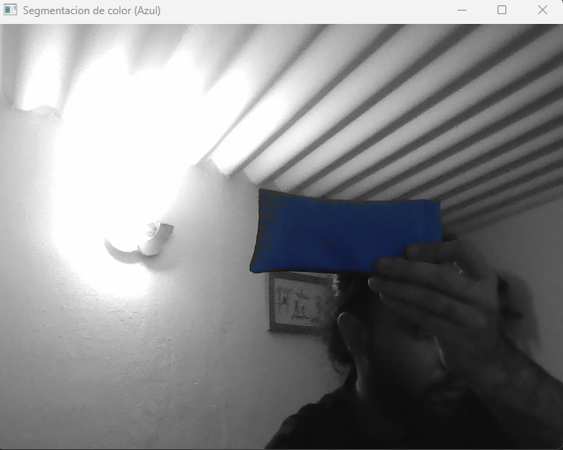
</div>

```python
def segmentacion_color_azul(frame):
    # Convertir la imagen de BGR a HSV
    hsv, lower_blue, upper_blue = cv2.cvtColor(frame, cv2.COLOR_BGR2HSV), np.array([100, 150, 50]), np.array([140, 255, 255])
    
    # Crear una máscara que detecte los píxeles dentro del rango del color azul,  
    # es un array donde los valores que no se encuentren en el intervalo valen cero
    mask = cv2.inRange(hsv, lower_blue, upper_blue)
    
    # Crear la imagen en escala de grises, podría tener color pero al haberla convertido primero a escala de grises se vería en blanco y negro
    gray = cv2.cvtColor(frame, cv2.COLOR_BGR2GRAY)
    gray_colored = cv2.cvtColor(gray, cv2.COLOR_GRAY2BGR)
    
    # Combinar la imagen en color con la imagen en escala de grises usando la máscara
    resultado = np.where(mask[:, :, np.newaxis] != 0, frame, gray_colored)
    
    cv2.imshow('Segmentacion de color (Azul)', resultado)
```
   - Modo Filtro Sepia (Tecla '3'): Aplica un filtro sepia, dando a la imagen un tono cálido estilo vintage.
<div align="center">
   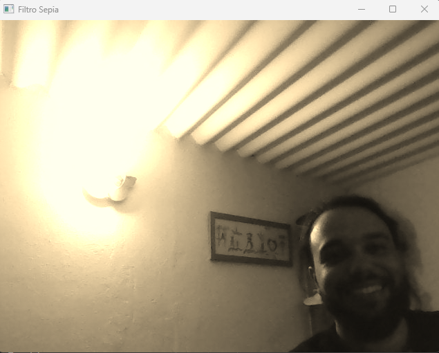
</div>

```python
def filtro_sepia(frame):
    sepia_filter = np.array([[0.272, 0.534, 0.131], [0.349, 0.686, 0.168], [0.393, 0.769, 0.189]])
    sepia = cv2.transform(frame, sepia_filter)
    cv2.imshow('Filtro Sepia', sepia)
```

Aqui se muestran más imagenes que demuestran el funcionamiento del codigo:
<div align="center">
   <table>
   <td width="50%">
      <div align="center">
         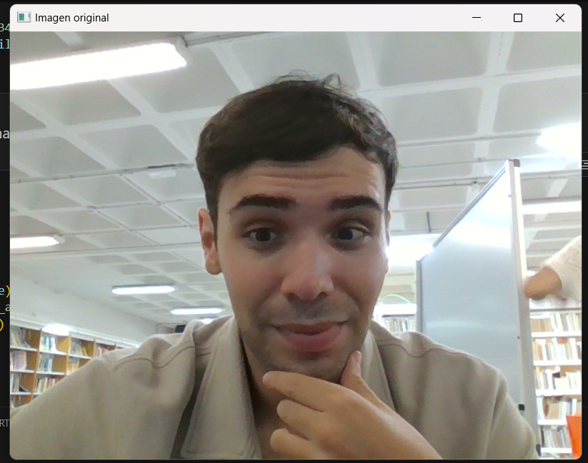
      </div>                                                 
   </td>
   <td width="50%">
      <div align="center">                                       
         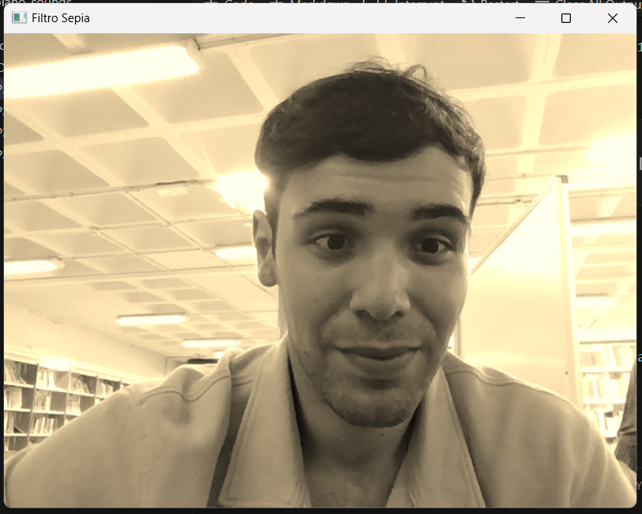
      </div>
   </td>
   </table>
   <table>
   <td width="50%">
      <div align="center">
         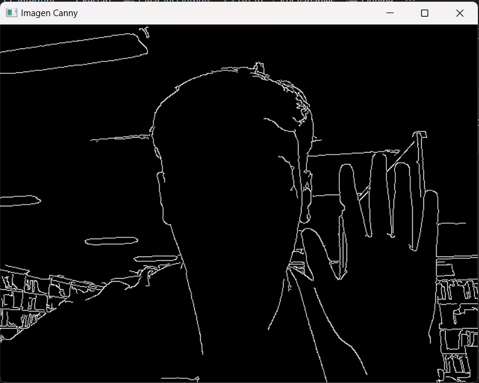
      </div>                                                 
   </td>
   <td width="50%">
      <div align="center">                                       
         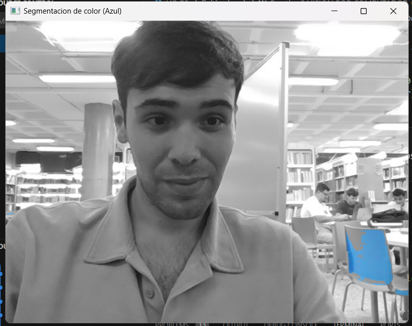
      </div>
   </td>
   </table>
</div>


# Tarea 4 Reinterpretación de la parte de procesamiento de la imagen

Después de ver el video de **Virtual Air Guitar**, decidimos reinterpretar la parte del procesamiento de imágenes creando un piano virtual en el aire. En este sistema, el usuario puede tocar el piano utilizando el movimiento de sus dedos. Para ello, comenzamos con un código base para la detección de manos [Medium MediaPipe](https://lvimuth.medium.com/hand-detection-in-python-using-opencv-and-mediapipe-30c7b54f5ff4) y, a partir de este punto, desarrollamos el resto de la funcionalidad necesaria para llevar a cabo la tarea.

<div align="center">
   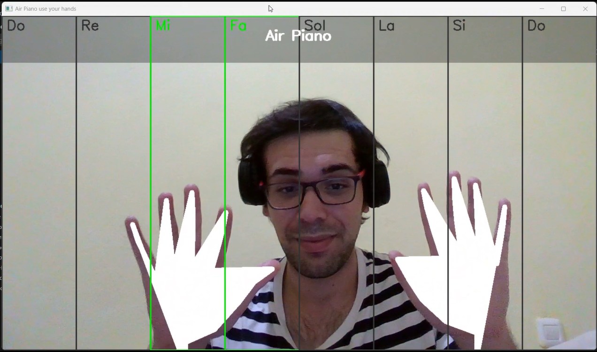
</div>

A continuación, presentamos un pequeño fragmento del código responsable del control de las manos para hacer sonar el piano:

```python
if is_piano_posture(fingers):
   if len(fingers) >= 8:
      for i in range(1, 9):
         if fingers[i] == 1:
            if not sustained_notes[i - 1]:
               play_sound(i, sustained=True)
               sustained_notes[i - 1] = True  # Marcar nota como sostenida
               zone_states[i - 1] = True  # Activar estado visual
            else:
               sustained_notes[i - 1] = False  # Resetear estado al bajar el dedo
               zone_states[i - 1] = False  # Desactivar estado visual
         else:
            x, y = handLms[8][1], handLms[8][2]
            current_zone = min(max((x // (frame.shape[1] // 8)) + 1, 1), 8)
            play_sound(current_zone)
            zone_states[current_zone - 1] = True  
```


---

> [!IMPORTANT]  
> Los archivos presentados aquí son una modificación de los archivos originales de [otsedom](https://github.com/otsedom/otsedom.github.io/tree/main/VC).

> [!WARNING]  
> Este codigo puede usarse sin problemas tampoco hay que preocuparse por el copyright de los sonidos del piano puesto que forman parte de [Freesound](https://freesound.org/) y la licencia
> que tienen es de libre uso 'Creative Commons 0'


---

## 📚 Bibliografía

1. [Opencv](https://docs.opencv.org/4.x/dc/da5/tutorial_py_drawing_functions.html)
2. [Medium MediaPipe](https://lvimuth.medium.com/hand-detection-in-python-using-opencv-and-mediapipe-30c7b54f5ff4)
3. [Sonidos de Piano Freesound](https://freesound.org/people/Jaz_the_MAN_2/packs/17749/)

---

**Universidad de Las Palmas de Gran Canaria**  
EII - Grado de Ingeniería Informática  
Obra bajo licencia de Creative Commons Reconocimiento - No Comercial 4.0 Internacional

---
